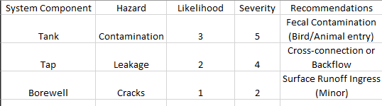

# Python Portfolio: WSP Automation, Real- World Applications & Core Logic

A portfolio showcasing Python applications in industrial risk management, business automation, and data analytics, and more!

## 🌟 Featured Project: Water Safety Plan (WSP) Risk Assessment
Developed during an internship, this tool automates the **Risk Assessment** phase of a Water Safety Plan. It processes raw data from infrastructure inspections to identify critical hazards in water systems.

* **Automation Logic:** Reads manual Excel logs containing 'Likelihood' and 'Severity' scores along with 'System Component', 'Hazard', and 'Recommendations'.
* **Risk Matrix Integration:** Automatically calculates a `Risk_Score` ($Likelihood \times Severity$) and categorizes hazards into **LOW**, **MEDIUM**, or **CRITICAL** action levels.
* **Impact:** Replaces manual calculations with a Python-driven pipeline using `pandas` and `os` libraries.

#### Input Data (Manual Log):

#### Final Risk Report & Assessment Plot:

---

## 📁 Real-World Applications and Core Logic Codes

### 1. Data Science & Advanced Analytics (NumPy & Pandas)
* **Array Statistics:** Computes mean, median, standard deviation, and identifies peak value indices.
* **Matrix Operations:** Implements element-wise addition, multiplication, and dot products.
* **Pandas DataFrames:** Features a **Student Result Table** with row-wise logic using `lambda` functions. 

### 2. Business & Financial Automation
* **Salary Slip Generator:** Automates payroll by calculating HRA, DA, and PF. 
* **Electricity Bill Summary:** A tiered billing system with automated 15% surcharge logic. 
* **Parking Charge Calculator:** Implements "upward rounding" for partial hours.

### 3. Mathematical Logic & Algorithms
* **Smart Grader:** Processes marks to calculate averages and assign letter grades. 
* **Triangle Validator:** Classifies triangles as Equilateral, Isosceles, Scalene, or Right-angled. 
* **Menu-Driven Tools:** Interface for checking Prime numbers, Palindromes, and Factorials.

